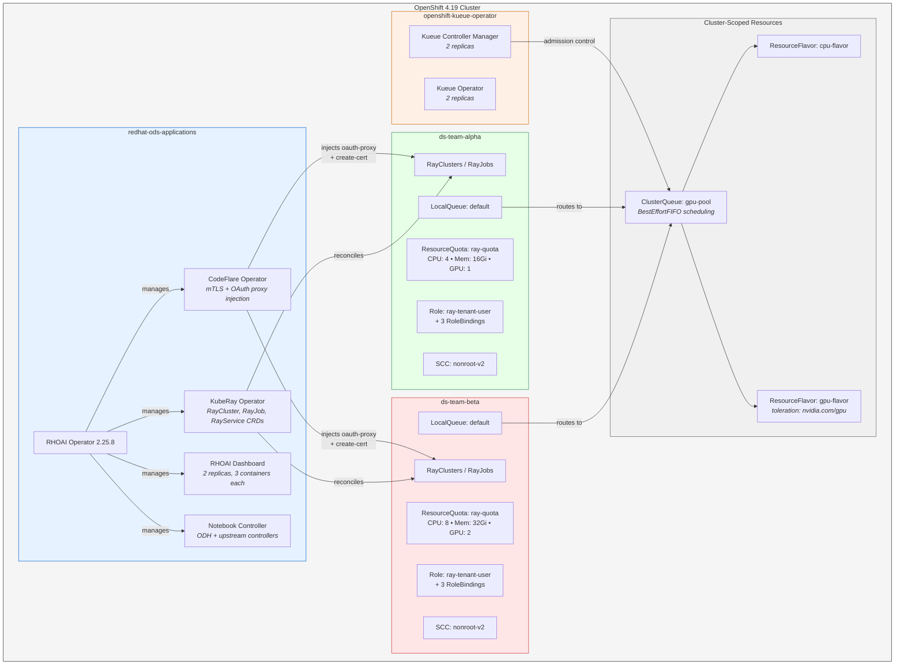
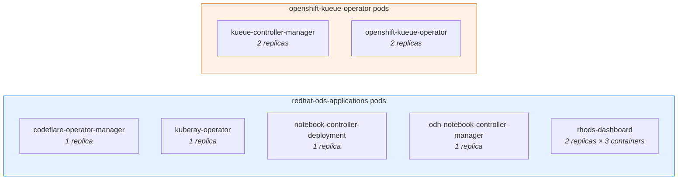
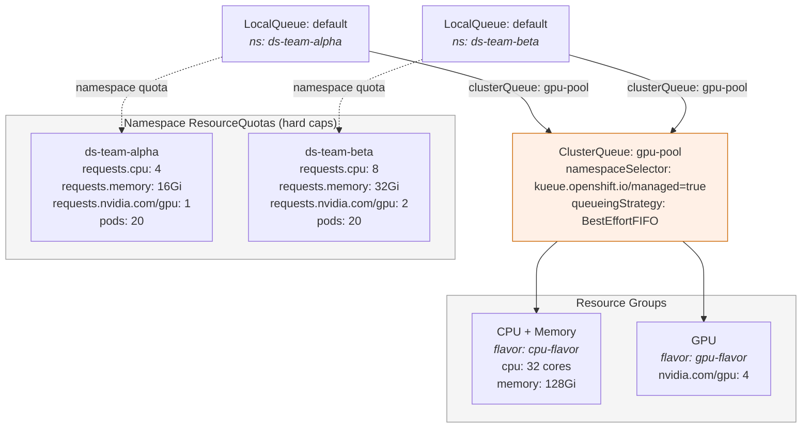
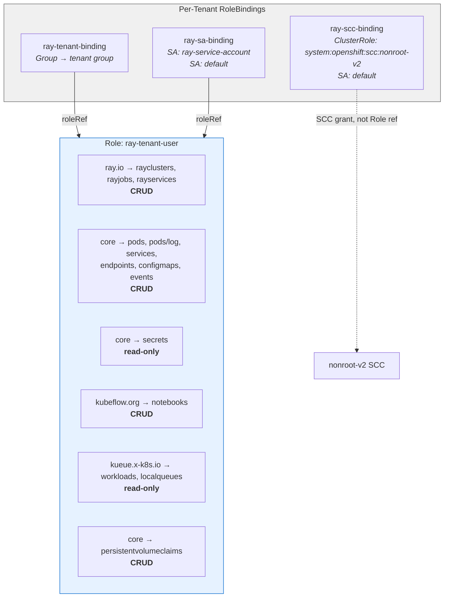
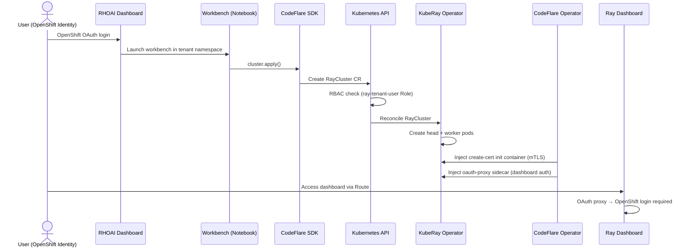
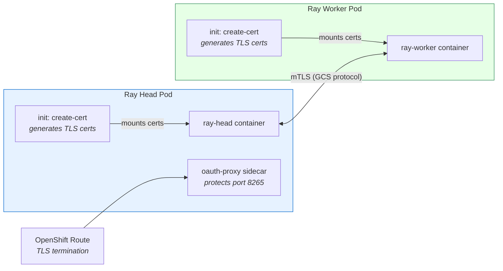
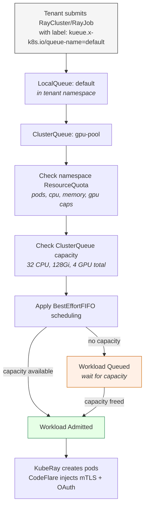
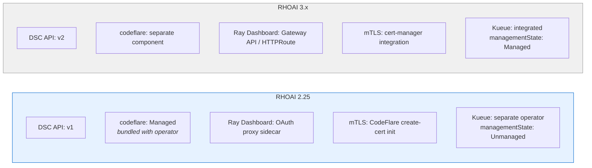

# Multi-Tenant KubeRay Architecture on RHOAI 2.25

## Overview

This document describes the architecture for running multi-tenant KubeRay workloads on Red Hat OpenShift AI (RHOAI) 2.25.8 with namespace-level isolation, RBAC, and Kueue-based quota management on OpenShift 4.19.

## Platform Architecture



## Operator Deployment (Verified)



## Kueue Quota Hierarchy



## RBAC Model



## Security Model

### Authentication & Authorization Flow



### mTLS Between Ray Nodes



## Workload Admission Flow



## Tenant Isolation Model

```mermaid
graph TD
    subgraph alpha["ds-team-alpha"]
        A_NS["Namespace<br/>labels: opendatahub.io/dashboard=true<br/>kueue.openshift.io/managed=true"]
        A_RQ["ResourceQuota: ray-quota<br/>requests.cpu: 4, memory: 16Gi<br/>nvidia.com/gpu: 1, pods: 20"]
        A_LR["LimitRange: ray-limits<br/>default: 2 CPU, 4Gi<br/>max: 8 CPU, 32Gi, 1 GPU"]
        A_LQ["LocalQueue: default → gpu-pool"]
        A_ROLE["Role: ray-tenant-user"]
        A_RB["RoleBinding: ray-tenant-binding<br/>→ Group: ds-team-alpha-users"]
        A_SA["ServiceAccount: ray-service-account<br/>+ RoleBinding: ray-sa-binding"]
        A_SCC["RoleBinding: ray-scc-binding<br/>→ ClusterRole: system:openshift:scc:nonroot-v2<br/>→ SA: default"]
    end

    subgraph beta["ds-team-beta"]
        B_NS["Namespace<br/>labels: opendatahub.io/dashboard=true<br/>kueue.openshift.io/managed=true"]
        B_RQ["ResourceQuota: ray-quota<br/>requests.cpu: 8, memory: 32Gi<br/>nvidia.com/gpu: 2, pods: 20"]
        B_LR["LimitRange: ray-limits<br/>default: 2 CPU, 4Gi<br/>max: 8 CPU, 32Gi, 1 GPU"]
        B_LQ["LocalQueue: default → gpu-pool"]
        B_ROLE["Role: ray-tenant-user"]
        B_RB["RoleBinding: ray-tenant-binding<br/>→ Group: ds-team-beta-users"]
        B_SA["ServiceAccount: ray-service-account<br/>+ RoleBinding: ray-sa-binding"]
        B_SCC["RoleBinding: ray-scc-binding<br/>→ ClusterRole: system:openshift:scc:nonroot-v2<br/>→ SA: default"]
    end

    alpha -.->|"DENIED: Alpha SA cannot<br/>create in Beta namespace"| beta
    beta -.->|"DENIED: Beta SA cannot<br/>create in Alpha namespace"| alpha

    style alpha fill:#e6ffe6,stroke:#2e8b57
    style beta fill:#ffe6e6,stroke:#cc3333
```



## DSC Configuration (API v1)

The DataScienceCluster custom resource on RHOAI 2.25 uses the `v1` API:

```yaml
apiVersion: datasciencecluster.opendatahub.io/v1
kind: DataScienceCluster
metadata:
  name: default-dsc
spec:
  components:
    codeflare:
      managementState: Managed       # Injects mTLS + OAuth into RayClusters
    ray:
      managementState: Managed       # Deploys KubeRay operator
    kueue:
      managementState: Unmanaged     # Kueue installed separately
      defaultClusterQueueName: gpu-pool
      defaultLocalQueueName: default
    dashboard:
      managementState: Managed       # RHOAI web console
    workbenches:
      managementState: Managed       # Jupyter notebook support
```

## RHOAI 2.25 vs 3.x Differences



## CodeFlare Operator Config

The `codeflare-operator-config` ConfigMap in `redhat-ods-applications` controls Ray security behavior. Key settings:

| Setting | Default | Description |
|---------|---------|-------------|
| AppWrapper autopilot | enabled | Anti-affinity injection, GPU health taints |
| Fault tolerance grace period | 60s | Admission grace period for workloads |

## Verified Deployment State

| Component | Version | Namespace | Replicas | Status |
|-----------|---------|-----------|----------|--------|
| RHOAI Operator | 2.25.8 | redhat-ods-operator | 3 | Running |
| CodeFlare Operator | (bundled) | redhat-ods-applications | 1 | Running |
| KubeRay Operator | (bundled) | redhat-ods-applications | 1 | Running |
| RHOAI Dashboard | (bundled) | redhat-ods-applications | 2 | Running |
| Notebook Controller | (bundled) | redhat-ods-applications | 2 | Running |
| Kueue Operator | 1.2.0 | openshift-kueue-operator | 2 | Running |
| Kueue Controller | (bundled) | openshift-kueue-operator | 2 | Running |

## Directory Structure

```
kray-ops/
├── platform/                    # Cluster-scoped resources (OPS)
│   ├── kustomization.yaml
│   ├── dsc.yaml                 # DataScienceCluster reference (v1 API)
│   ├── clusterqueue.yaml        # gpu-pool: 32 CPU, 128Gi, 4 GPU
│   ├── resourceflavor-cpu.yaml
│   └── resourceflavor-gpu.yaml  # GPU toleration: nvidia.com/gpu
├── tenant-base/                 # Kustomize base for all tenants
│   ├── kustomization.yaml
│   ├── namespace.yaml           # labels: dashboard=true, kueue managed=true
│   ├── resource-quota.yaml
│   ├── limit-range.yaml
│   ├── local-queue.yaml         # default → gpu-pool
│   ├── role-ray-user.yaml       # 6 rule groups
│   ├── rolebinding.yaml         # Group binding
│   ├── sa-rolebinding.yaml      # SA binding (ray-service-account + default)
│   ├── scc-binding.yaml         # nonroot-v2 for default SA
│   └── sa-ray.yaml
├── tenant-overlays/
│   ├── tenant-a/                # ds-team-alpha: 4 CPU, 16Gi, 1 GPU
│   └── tenant-b/                # ds-team-beta:  8 CPU, 32Gi, 2 GPU
├── scripts/
│   ├── onboard-tenant.sh        # Automated provisioning with pre-flight checks
│   └── validate-tenant.sh       # 11 isolation tests (RBAC, Kueue, infra)
└── docs/
    ├── architecture.md
    ├── onboarding-guide.md
    └── tenant-user-guide.md
```
